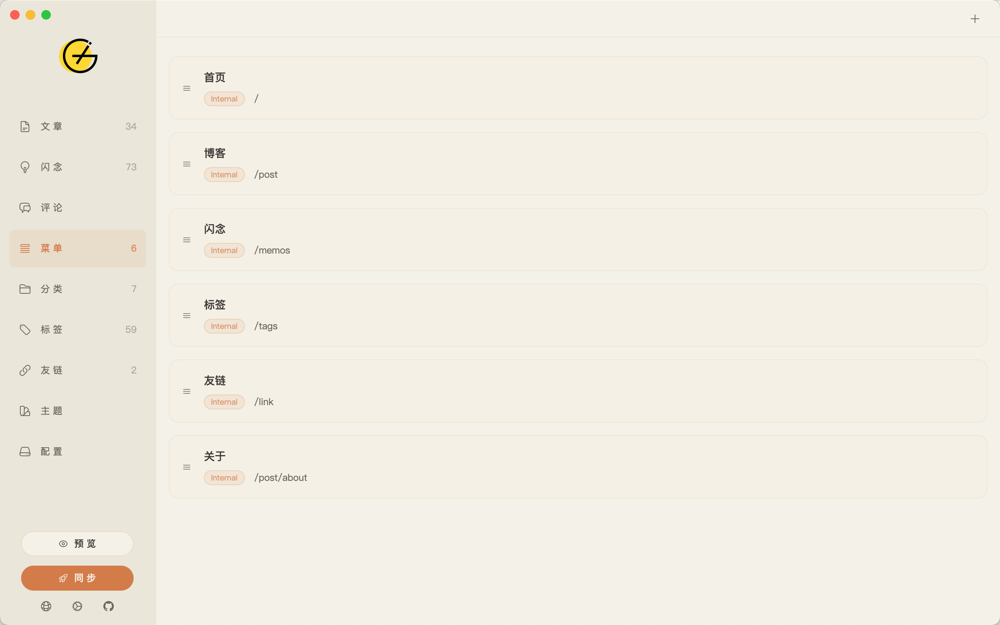

<p align="center">
  
</p>

<h1 align="center">Gridea Pro</h1>

<p align="center">
  The next-generation desktop static blog client — write like you're in Notion, publish with one click.
</p>
<p align="center">
  A static blog writing client built on Wails (Go + Vue 3). Free and open source, forever.
</p>

<p align="center">
  <a href="LICENSE"></a>
  <a href="https://github.com/Gridea-Pro/gridea-pro/releases"></a>
  
  
  
  <a href="README.md"></a>
</p>

<p align="center">
  <b>English</b> · <a href="README.md">简体中文</a>
</p>

---

<p align="center">
  <b>Live Demo</b>&nbsp;&nbsp;👉&nbsp;&nbsp;<a href="https://are.ink/">are.ink</a>
</p>

---

**Gridea Pro** is a complete rewrite of [Gridea](https://github.com/getgridea/gridea) (10k+ Stars), rebuilt from scratch with Go + Wails + Vue 3. The original Gridea has been unmaintained for about four years. Gridea Pro carries forward its core vision: **making it effortless for anyone to own their own blog.**

Special thanks to the original author [@EryouHao](https://github.com/EryouHao) for creating [Gridea](https://github.com/getgridea/gridea) and helping countless people start their blogs.

---

## Screenshots

<table>
  <tr>
    <td align="center"><b>Post Management</b></td>
    <td align="center"><b>Writing Editor</b></td>
  </tr>
  <tr>
    <td></td>
    <td></td>
  </tr>
  <tr>
    <td align="center"><b>Memos</b></td>
    <td align="center"><b>Comment Management</b></td>
  </tr>
  <tr>
    <td></td>
    <td></td>
  </tr>
  <tr>
    <td align="center"><b>Menu Management</b></td>
    <td align="center"><b>Category Management</b></td>
  </tr>
  <tr>
    <td></td>
    <td></td>
  </tr>
  <tr>
    <td align="center"><b>Tag Management</b></td>
    <td align="center"><b>Theme Management</b></td>
  </tr>
  <tr>
    <td></td>
    <td></td>
  </tr>
</table>

---

## Why Gridea Pro?

Hugo, Hexo, and Jekyll are great tools — but they're built for developers. You need to install Node.js, learn the CLI, and write your own deployment scripts. Gridea Pro takes a different path: **download and go, everything lives in a GUI, with AI capabilities built right in.**

| | Gridea Pro | Hugo | Hexo |
|---|:---:|:---:|:---:|
| Installation | Desktop app | CLI | CLI + Node.js |
| Learning curve | Zero — no terminal needed | Requires CLI experience | Requires Node.js + CLI |
| Writing environment | Built-in Monaco editor | Choose your own editor | Choose your own editor |
| Theme switching | Visual UI in-app | Edit config files | Edit config files |
| One-click deploy | ✅ GUI | ❌ Manual / CI | ❌ Manual / CI |
| AI integration | ✅ MCP + built-in model | ❌ | ❌ |
| Memory usage | ~30–50 MB | — | — |
| Template engines | Jinja2 / EJS / Go | Go Templates | EJS / Nunjucks |

> Hugo and Hexo are powerful tools for developers. Gridea Pro is designed for people who just want to write.

---

## Features

### ✍️ Writing & Editor

- **Monaco Editor** (the same engine behind VS Code): syntax highlighting, IntelliSense, Vim/Emacs key bindings
- Markdown extensions: math formulas (KaTeX), footnotes, task lists, Emoji, auto table of contents
- Code block syntax highlighting for all major languages
- Live preview
- Precise CJK word count and estimated reading time

### 📋 Content Management

- Posts: tags, categories, pinning, drafts, custom URL slugs, featured images
- **Memos**: quick-capture notes with `#tag` syntax, image attachments, and heatmap statistics
- Friend links and navigation menu management
- Comment management: reply and delete (requires a connected comment system)
- Full-text search

### 🎨 Theme System

- **9 built-in themes**, switch with one click: `amore`, `flavor`, `claudo`, `letters`, `inotes`, `fly`, `simple`, `notes`, and more
- Three template engines: **Jinja2 (Pongo2)**, **EJS**, **Go Templates**
- Visual theme configuration — `config.json` declarations are rendered as a UI form, no file editing required
- Dark mode and responsive layout support

### 🚀 Deployment

- One-click deploy to 6 platforms: GitHub Pages, Vercel, Netlify, Gitee, Coding, SFTP/FTP
- Pure Go Git engine built in — **no system Git required**, more reliable syncing
- CDN media upload: automatically sync images and assets to a GitHub repository on deploy, with customizable path templates
- Custom domain (CNAME) support

### 🔍 SEO

- Auto-generates `sitemap.xml` (with image metadata), `robots.txt`, RSS/Atom Feed
- Open Graph and Twitter Card meta tags for social sharing
- JSON-LD structured data
- Google Analytics, Baidu Analytics, Google Search Console verification
- Custom `<head>` code injection

### 💬 Comment Systems

7 comment systems built in — enable with a checkbox, no manual code integration needed:

<table>
  <tr>
    <td align="center"><b>Gitalk</b></td>
    <td align="center"><b>Giscus</b></td>
    <td align="center"><b>Disqus</b></td>
    <td align="center"><b>Valine</b></td>
    <td align="center"><b>Waline</b></td>
    <td align="center"><b>Twikoo</b></td>
    <td align="center"><b>Cusdis</b></td>
  </tr>
</table>

### 🤖 AI Integration (MCP)

Gridea Pro implements the [Model Context Protocol (MCP)](https://modelcontextprotocol.io/), letting AI assistants like Claude and Cursor manage your blog directly:

**25+ MCP tools** covering the full blog workflow:

| Category | Tools |
|----------|-------|
| Posts | list, get, create, update, delete |
| Memos | list, create, update, delete, heatmap stats |
| Tags / Categories | full CRUD |
| Menus / Links | full CRUD |
| Comments | list, reply, delete |
| Themes | list themes, get / update theme config |
| Site | get / update global settings |
| Render & Deploy | trigger render, trigger deploy (opt-in) |

**5 built-in workflow prompts**: writing assistant, memo-to-post, content review, site health check, post translation.

**MCP configuration example:**

```json
{
  "mcpServers": {
    "gridea-pro": {
      "command": "/path/to/gridea-pro",
      "args": ["--mcp"],
      "env": {
        "GRIDEA_SITE_DIR": "/path/to/your/site",
        "DEPLOY_ENABLED": "false"
      }
    }
  }
}
```

> Set `DEPLOY_ENABLED=true` to allow AI to trigger deployments. Disabled by default — requires manual confirmation.

**Built-in AI model**: Use the built-in free model with no API key required (20 calls/day limit). Or connect your own: 13 providers supported, including OpenAI, Anthropic, DeepSeek, Gemini, Kimi, Qwen, GLM, and more.

### 📱 PWA Support

- Enable Progressive Web App with a single toggle
- Configurable: app name, icon, theme color, screen orientation, and more
- Users can "install" your blog to their phone or desktop for offline access

### 🌍 Internationalization

The app interface supports **11 languages**:

`English` · `简体中文` · `繁體中文` · `日本語` · `한국어` · `Deutsch` · `Español` · `Français` · `Italiano` · `Português (BR)` · `Русский`

---

## Getting Started

### Download & Install

Download the installer for your platform from the [Releases](https://github.com/Gridea-Pro/gridea-pro/releases) page:

| Platform | Package |
|----------|---------|
| macOS | `.dmg` |
| Windows | `.exe` |
| Linux | `.AppImage` / `.deb` |

Double-click to install and start writing.

**Migrating from Gridea**: Point the "Site Directory" setting to your existing Gridea data folder. Gridea Pro will migrate your data automatically on first launch — no manual steps required.

### Build from Source

**Prerequisites**: Go 1.22+, Node.js 18+, [Wails v2](https://wails.io/)

```bash
git clone https://github.com/Gridea-Pro/gridea-pro.git
cd gridea-pro

cd frontend && npm install && cd ..

# Development mode (hot reload)
wails dev

# Production build
wails build
```

---

## Theme Development

Gridea Pro supports three template engines. Jinja2 (Pongo2) is recommended. Theme directory structure:

```
my-theme/
├── config.json          # Theme config declaration (auto-generates the settings UI panel)
├── templates/
│   ├── index.html       # Home page
│   ├── post.html        # Post detail page
│   ├── tag.html         # Tag page
│   ├── archives.html    # Archives page
│   └── partials/        # Reusable components
└── assets/
    ├── styles/
    └── scripts/
```

See the [Theme Development Guide](https://github.com/Gridea-Pro/gridea-pro/wiki/Theme-Development) for full documentation.

---

## Contributing

Issues and Pull Requests are welcome! Please read [CONTRIBUTING.md](CONTRIBUTING.md) before contributing.

```bash
# Fork and clone
git clone https://github.com/<your-username>/gridea-pro.git

# Create a feature branch
git checkout -b feature/your-feature

# Submit a PR when ready
```

---

## Acknowledgements

- [Gridea](https://github.com/getgridea/gridea) — The original project. Thanks to [@EryouHao](https://github.com/EryouHao) for the pioneering work
- [Wails](https://wails.io/) — Go desktop application framework
- [Vue 3](https://vuejs.org/) — Frontend framework
- [Monaco Editor](https://microsoft.github.io/monaco-editor/) — Editor engine
- [Pongo2](https://github.com/flosch/pongo2) — Jinja2-compatible template engine for Go
- [KaTeX](https://katex.org/) — Math formula rendering
- [Tailwind CSS](https://tailwindcss.com/) — CSS framework

---

## License

[GPL-3.0](LICENSE) &copy; Gridea Pro
